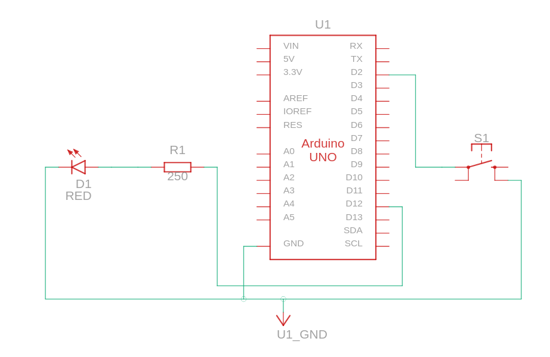

# ⚡ Arduino Variable Speed LED Controller  
A responsive hardware simulation built in Tinkercad that dynamically controls an LED's blink rate using a tactile pushbutton switch and custom C++ state logic.  
---
## 📺 Project Demo  
> **How it works:** By default, the LED blinks at a calm, 1-second interval. Holding down the button acts as a "Turbo Mode", dynamically switching the blink delay to an ultra-fast 50ms strobe. Releasing the button instantly recovers the original speed.  
[Project Demo Video](arduino_blinkSpeed.webm)  
---
## 🛠️ Circuit Diagram & Hardware Layout  
The circuit utilizes an internal pull-up resistor configuration to eliminate signal floating on the digital input pin without requiring external hardware resistors.  
### Component List  
* **1x** Arduino Uno R3  
* **1x** Red LED  
* **1x** Resistor(250 ohms)   
* **1x** Pushbutton Switch  
### Wiring Pinout  
| **LED Anode (+)** | Via Resistor | **Digital Pin 12** |  
| **LED Cathode (-)** | Straight to Ground | **GND** |  
| **Pushbutton** | Terminal 1a | **Digital Pin 2** |  
| **Pushbutton** | Terminal 2b | **GND** | 
   
  
---
## 🧠 The Logic & Code  
Instead of cycling through messy increments, this code leverages an intuitive `if-else` state structure to evaluate the mechanical button configuration instantly on every loop cycle.  
```cpp
// Variable Speed LED Control Scheme
int blink_speed = 1000;

void setup()
{
  pinMode(12, OUTPUT);       // Initialize LED Control Pin
  pinMode(2, INPUT_PULLUP);  // Initialize Button with Internal Pull-Up
}

void loop()
{
  // Check if button circuit is grounded (Pressed)
  if (digitalRead(2) == LOW) {
    blink_speed = 50;        //  Speed of blinking
    delay(200);              // Primitive hardware debounce handling
  } 
  else {
    blink_speed = 1000;      // Calm Standard Mode Speed
  }
  
  // Execution Phase
  digitalWrite(12, HIGH);
  delay(blink_speed);
  digitalWrite(12, LOW);
  delay(blink_speed);
}
